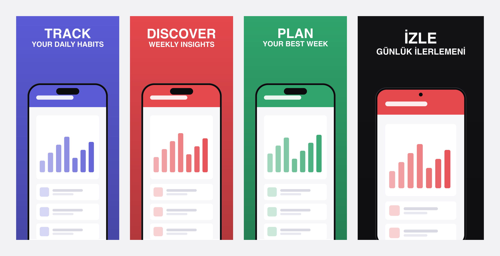

# storeshots-mcp

**Store-ready App Store and Google Play screenshots, generated by your AI agent.**

An MCP (Model Context Protocol) server that turns raw app screenshots into polished, pixel-perfect store listing visuals: device frames, bold benefit-driven headlines, brand colors, and exact store dimensions for iOS and Android. Your agent writes the copy, storeshots renders the pixels.

<!-- hero showcase image: assets/showcase.png -->
<p align="center">
  
</p>

<p align="center">
  <a href="https://www.npmjs.com/package/storeshots-mcp"></a>
  
  
  
</p>

## Why

Making store screenshots is the least fun part of shipping an app. Design tools are manual, screenshot SaaS products are paid and template-locked, and fastlane frameit only frames iOS devices without any marketing layer.

storeshots-mcp takes a different approach. It splits the job the way it should be split:

| The agent (Claude, Cursor, etc.) | The server (storeshots) |
|---|---|
| Reads your codebase, finds the benefits | Renders text with pixel-perfect typography |
| Writes punchy headlines | Composes device frames and backgrounds |
| Translates copy into any language | Enforces exact store dimensions |
| Picks which screen sells which feature | Outputs deterministic, reviewable PNGs |

No API keys. No accounts. No image-generation costs. Everything renders locally and deterministically, so the same input always produces the same output.

## Quickstart

### Claude Code

```bash
claude mcp add storeshots -- npx -y storeshots-mcp
```

### Claude Desktop / Cursor / Windsurf / Antigravity / VS Code

Add to your MCP config (`claude_desktop_config.json`, `.cursor/mcp.json`, or equivalent):

```json
{
  "mcpServers": {
    "storeshots": {
      "command": "npx",
      "args": ["-y", "storeshots-mcp"]
    }
  }
}
```

### Codex CLI

Add to `~/.codex/config.toml`:

```toml
[mcp_servers.storeshots]
command = "npx"
args = ["-y", "storeshots-mcp"]
```

storeshots-mcp is a plain stdio MCP server with zero client-specific behavior, so it runs in any MCP-capable agent: Claude Code, Claude Desktop, Cursor, Windsurf, Antigravity, Codex, Gemini CLI, VS Code, Zed, and whatever ships next week.

Prefer no server at all? The same engine is available as a CLI:

```bash
npx storeshots compose --preset ios-phone --bg "#E31837" \
  --verb "TRACK" --desc "YOUR DAILY MOOD" \
  --screenshot ./raw/home.png --output ./out/en_01.png
```

Then just ask:

> "Take the screenshots in ./raw-shots and generate a full App Store and Play Store set. Brand color #E31837, 6 screenshots per platform, English and Turkish."

## What you get

- **4 platform presets** with exact store-required dimensions:

  | Preset | Store | Dimensions |
  |---|---|---|
  | `ios-phone` | App Store, iPhone 6.9" | 1320 × 2868 |
  | `android-phone` | Google Play, phone | 1080 × 1920 |
  | `ipad-13` | App Store, iPad Pro 13" | 2064 × 2752 |
  | `android-tablet` | Google Play, 10" tablet | 1600 × 2560 |

- **Device frames** for iPhone, Pixel-style Android, iPad, and Android tablet, bundled as assets
- **Benefit-first headline layout**: a bold action verb plus a short descriptor, sized and positioned for store shelf impact
- **Smart contrast**: text color flips between light and dark based on background luminance
- **Full Unicode typography**: bundled OFL-licensed font renders İ, Ğ, Ş, Ü, ß, and accented characters correctly in all caps
- **Showcase composer**: one wide preview image of the whole set, ready for your repo, tweet, or client deck

## Tools

| Tool | Description |
|---|---|
| `list_presets` | Returns all platform presets with dimensions and layout metrics |
| `compose_screenshot` | Renders one screenshot: background, device frame, headline, source image |
| `generate_set` | Batch-renders a full ordered set for one platform and language |
| `create_showcase` | Composes a preview strip from generated screenshots |
| `validate_screenshot` | Checks an image against store dimension and format requirements |

Every tool returns file paths plus a structured summary, so the agent can review output and iterate.

## Multi-language sets

Translation happens in the agent, not the server. Generate your English set, then ask for any locale:

> "Now generate the same set in Turkish and German."

The agent translates the headlines idiomatically, and storeshots renders them with correct locale-specific casing and special characters. Output follows a clean convention:

```
output/
  en/ios-phone/en_01.png … en_06.png
  tr/ios-phone/tr_01.png … tr_06.png
  de/android-phone/de_01.png … de_06.png
```

## Design principles

1. **Deterministic**: no AI image generation in the render path. Same input, same pixels, every time.
2. **Zero config**: no API keys, no sign-ups, works fully offline.
3. **Store-correct by construction**: output dimensions are enforced, not suggested.
4. **Agent-native**: tools expose structured data, and the copywriting intelligence stays in the model where it belongs.

## Roadmap

- [ ] Claude Code skill layer: guided benefit-discovery workflow on top of the MCP tools
- [ ] Play Store feature graphic preset (1024 × 500)
- [ ] Layout variants: device-bottom, device-tilted, text-bottom
- [ ] Custom device frame support
- [ ] Panoramic sets (one background flowing across multiple screenshots)

## Contributing

Issues and PRs are welcome. See [AGENTS.md](AGENTS.md) for architecture and conventions; it is written for both human contributors and coding agents.

## License

[MIT](LICENSE)
